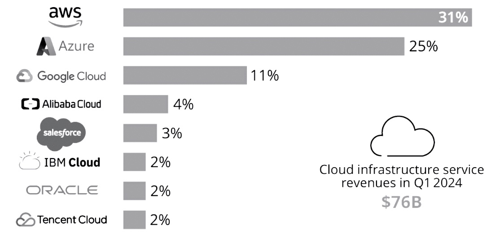

## What is the cloud?

The cloud is essentially just a bunch of servers, and servers are simply computers that never go to sleep so
that our websites and apps are always available whenever someone needs them. Imagine you have a powerful computer in a secure location that's always on, no matter what. Instead of keeping this computer in your office, you rent space on it from a company that specializes in running and maintaining these computers-this is what we call "the cloud." The cloud allows you to store data, run applications, and manage your business's digital operations without needing to own or manage the physical hardware yourself. It's like renting an always-on, super reliable computer that you can access from anywhere, anytime.

## Why do I need the cloud?

Renting servers in the cloud is easier than managing them yourself because you don't have to worry about the hassle of buying and maintaining your own hardware. When you rent, you don't need to invest in a new computer every few years or deal with the headaches of upgrading and fixing it when something goes wrong. The cloud provider takes care of keeping the servers running, so you don't have to worry about things like power outages or hardware failures. This allows you to focus on growing your business instead of managing technology.

## What is meant by cloud architecture?

When we talk about "architecture" in tech, we're referring to the way all the different parts of a system are designed and how they work together. For example, you might hear about servers, which are computers that handle requests like showing a webpage or storing data. Then there's "serverless" architecture, which means you don't manage the servers yourself-everything runs automatically in the cloud, scaling up or down based on demand. A database is another key part of architecture; it's where all your important information, like customer data, is stored and organized so it can be quickly accessed when needed. All these components come together to create the backbone of your technology system.

## A slightly deeper dive into the cloud

The cloud lets us store files like spreadsheets, images, or any other data on powerful computers, called servers, that are always running and accessible over the internet. Instead of saving these files on your personal computer or a single office server, you can use cloud storage solutions like Amazon S3, which work like an advanced version of Dropbox, but designed to handle huge amounts of data securely and reliably. Additionally, instead of relying on just one large server in a central location, you can use a Content Delivery Network (CDN). A CDN spreads many small servers around the world, so when someone accesses your content, it gets delivered from the server closest to them, making it faster and more efficient. This flexibility and scalability are what make the cloud so powerful for businesses.

## How do I choose between AWS, Azure, and GCP?

Renting servers in the cloud is easier than managing them yourself because you don't have to worry about the hassle of buying and maintaining your own hardware. When you rent, you don't need to invest in a new computer every few years or deal with the headaches of upgrading and fixing it when something goes wrong. The cloud provider takes care of keeping the servers running, so you don't have to worry about things like power outages or hardware failures. This allows you to focus on growing your business instead of managing technology.

    source: 
    https://www.statista.com/chart/18819/worldwide-market-share-of-leading-cloud-infrastructure-service-providers/

  
  
  
When choosing between AWS, Google Cloud, and Microsoft Azure, it's important to know that all three cloud providers offer very similar services, especially for early-stage startups. However, AWS and Microsoft Azure are the largest players in the market, together controlling over 50% of the cloud market share. This dominance means that when you're starting a business, it's generally easier to find developers with experience in AWS or Azure, making it simpler to build and scale your team. While Google Cloud is a strong option too, choosing AWS or Azure can give you access to a larger talent pool and more established resources as you grow.

## Executive Summary

When choosing between AWS, Google Cloud, and Microsoft Azure, it's important to know that all three cloud providers offer very similar services, especially for early-stage startups. However, AWS and Microsoft Azure are the largest players in the market, together controlling over 50% of the cloud market share. This dominance means that when you're starting a business, it's generally easier to find developers with experience in AWS or Azure, making it simpler to build and scale your team. While Google Cloud is a strong option too, choosing AWS or Azure can give you access to a larger talent pool and more established resources as you grow.
